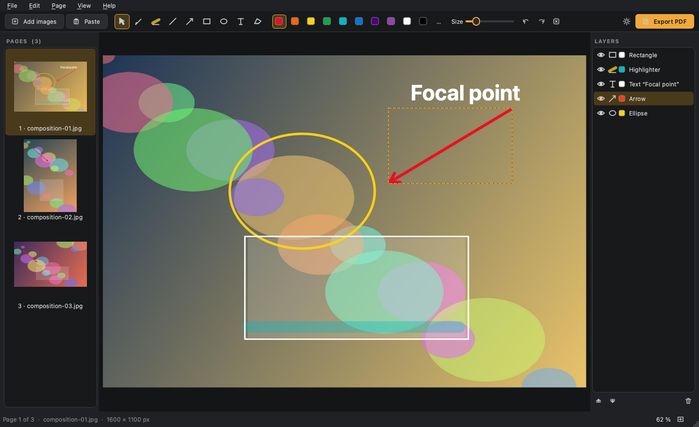

# DriloReview

[](https://github.com/Cokedrilo/DriloReview/releases/latest/download/DriloReview-1.1.0-portable-win64.zip)
[](https://github.com/Cokedrilo/DriloReview/releases/latest/download/DriloReview-1.1.0-macos.zip)
[](https://github.com/Cokedrilo/DriloReview/releases/latest)
[](LICENSE)

**Drag images in, draw on them, export them all as one PDF.** By Drilo.

The annotation tools of [DriloBoard](https://github.com/Cokedrilo/DriloBoard),
on their own: each image is a page, you mark it up with arrows, circles,
highlighter and text, move things around on layers, and get a single PDF with
the drawings as sharp vectors. Your image files are never modified.

### ⬇ Try it in one minute

**[Download for Windows](https://github.com/Cokedrilo/DriloReview/releases/latest/download/DriloReview-1.1.0-portable-win64.zip)**
→ unzip anywhere → run `DriloReview.exe`. Nothing is installed and nothing is
written to the registry; it runs from a USB stick. Windows will warn about an
unknown publisher the first time (the executable is not signed): *More info* →
*Run anyway*.

**[Download for Mac](https://github.com/Cokedrilo/DriloReview/releases/latest/download/DriloReview-1.1.0-macos.zip)**
→ unzip → open `DriloReview.app`. One app for Intel and Apple Silicon, macOS 13
or later. The app is not notarised, so the first time macOS refuses to open it:
right-click → *Open*, or run once in Terminal
`xattr -dr com.apple.quarantine /path/to/DriloReview.app`.

> Manual en español: [README.es.md](README.es.md)



<sub>Pages on the left, the page you are drawing on in the middle, its layers on
the right. The images are generated samples.</sub>

## What it does

- **Add images** by dragging them (or whole folders) onto the window, or
  **paste** them with Ctrl+V / ⌘V: a screenshot, an image copied from a web
  page, or files copied in Explorer / Finder. Reorder the pages by dragging.
- **Draw**: pen, highlighter, line, arrow, rectangle, ellipse and text, ten
  colours a click away. Shift gives 45° lines, squares and circles. Line
  thickness scales with the image, so it looks the same on a small picture and
  on a 6000 px photo.
- **Move what you drew**: with *Select and move* (V) click any drawing and
  drag it. Click a colour to recolour it, double-click a text to edit it,
  copy, paste and duplicate drawings.
- **Layers**: every drawing is a layer; the top of the list is in front. Drag
  to reorder, click the eye to hide (hidden layers are left out of the PDF).
- **Export PDF**: one page per image, shaped like each image or on A4 / Letter
  turned to suit, with optional margins, page numbers and file names, and a
  choice of image resolution to keep the file small.
- **Undo everything** (Ctrl+Z / ⌘Z): strokes, moves, colours, layers, pages.
- **Projects** (`.driloreview`) keep the pages and the drawings to carry on
  later. They store paths relative to the project, so a folder with the project
  and its images can move to another computer — Windows or Mac. Pasted images
  are copied next to the project.

Press **F1** inside the app for the full list of shortcuts.

## From source

Python 3.9 or later and PySide6:

- Windows: double-click `DriloReview.bat`
- macOS and Linux: `./driloreview.sh`

The first run creates a `.venv` and installs `PySide6-Essentials`.

Tests (they run without opening any window and never touch your settings):

```
python tests/test_driloreview.py
```

Building the portable packages: `build_windows.bat` on Windows,
`./build_macos.sh` on a Mac. Both call `build.py`, which draws the icon from
code, packages with PyInstaller, runs the packaged app with `--selftest` and
zips the result. Pushing a `v*` tag makes GitHub Actions build, test and
publish both versions.

## Licence

MIT © 2026 Drilo
